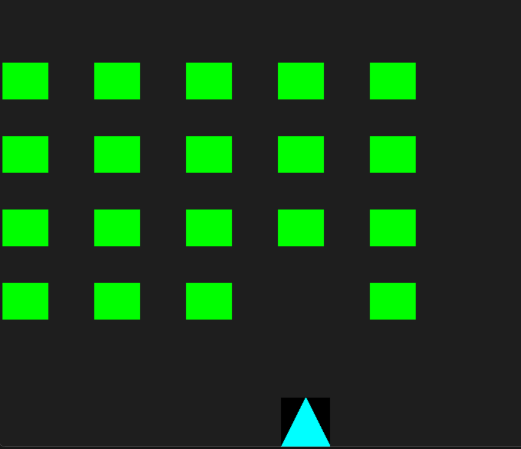

# 🚀 Alien Invasion Game

A classic Alien Invasion arcade-style shooter made in Python using **Pygame**.  
This project was built as part of a resume portfolio — showcasing skills in object-oriented programming, basic game development, and GitHub project structuring.

---

## 🎮 Gameplay

- Control the ship using arrow keys (← ↑ ↓ →)
- Press **Spacebar** to shoot
- Game ends when an alien hits the ship
- Aliens get faster every 1000 points
- Press **R** to restart after game over

---

## 📸 Screenshot

> *(Make sure `screenshot.png` is placed in the `images/` folder inside your repo)*

---

## 🧱 Features

- Smooth 2D movement (left, right, up, down)
- Bullet shooting with collision detection
- Dynamic alien fleet generation
- Increasing difficulty over time
- Game Over + Restart
- Score + High Score display

---

## 🛠 Technologies Used

- Python 3
- Pygame 2.6+
- OOP principles
- Git + GitHub for version control

---

## 🧩 Setup Instructions

1. Clone the repo:

